We consider the Quadratic Assignment Problem, a classical combinatorial optimization problem in which a set of facilities must be assigned to a set of locations in a way that minimizes the total cost. The cost is defined based on flows between facilities and distances between locations, leading to a quadratic objective function.

## Chosen instances:
 - esc16
 - lipa40a
 - lip60a
 - lipa80a
 - sko90
 - sko100a
 - tai100b
 - 150b
 - tai256c

The instances were chosen to ensure diversity in size and structure, in order to increase the difficulty for the algorithm. Such a selection provides a comprehensive evaluation environment for comparing the performance, stability, and efficiency of the considered algorithms across different types of QAP instances.

## Our Implementation

The implementation was written in Go and focuses on efficiency and fair comparison of different algorithms for the Quadratic Assignment Problem. Solutions are represented as permutations, and the objective function is evaluated using a standard quadratic cost formulation based on flow and distance matrices stored in row-major format.

To improve performance, a delta evaluation function is implemented, allowing the cost difference between neighboring solutions (generated by swapping two positions) to be computed in $O(n)$ time instead of recomputing the full objective in $O(n^2)$. This is crucial for local search methods (Greedy and Steepest), which evaluate many neighboring solutions.

The heuristic constructs an initial permutation by ranking locations and objects based on their connectivity scores, summing the corresponding rows and columns of matrices $A$ and $B$. It then matches the closest locations with the highest flows.

### Neighbour Operator

The implemented algorithms use a 2-swap neighborhood operator, which is standard for the Quadratic Assignment Problem. A neighboring solution is generated by selecting two distinct positions $i$ and $j$ in the permutation and swapping the assigned facilities. The size of the neighborhood for a permutation of size $n$ is:

$$
\frac{n(n-1)}{2}
$$

Instead of recomputing the full objective function for each neighbor (which would take $O(n^2)$), the implementation uses a delta evaluation function that computes the cost difference between two solutions differing by a swap in $O(n)$ time.

## Metaheuristics

Simulated Annealing uses an adaptive initialization of the temperature, chosen so that approximately 95% of worsening moves are accepted at the beginning of the search. To ensure good results in terms of both execution time and solution quality, we experimented with different parameter settings. The Markov chain length is kept constant and defined proportionally to the neighbourhood size (neighbour_size/divider). For the divider, we tested several values starting from 20 and gradually reduced it to 2. The parameter P was also important to prevent the algorithm from terminating too early. Initially, we used a constant value of 10; however, we observed that the algorithm stopped too early for larger instances, so we correlated this parameter with the input size. Finally, we set it to 2*n, where n is the length of a row in the input data. The cooling rate parameter alpha, which controls the speed of temperature decrease, was set to 0.97. This relatively high value matched our observations and allowed the algorithm to maintain good exploration capability throughout the search process.

To ensure a good balance between solution quality and execution time in Tabu Search, we also experimented with different parameter settings and finally set it to: elite candidate list size = k=n/10, tabu tenure to n/4 and maxnoimprovements 2*n.
The elite-candidate mechanism in Tabu Search evaluates the full swap neighborhood at each iteration, filtering out tabu moves unless they satisfy aspiration (the move yields a solution better than the current global best), then sorting the remaining feasible moves by delta and keeping only the top elite subset (eliteK = n/10) as the candidate list. From this short list, each move is rechecked for tabu/aspiration consistency before being applied, with tabu tenure set by assigning an expiry time (iterations + n/4) to the selected swap pair in both matrix directions, and if the resulting solution improves the best-known quality, the best solution is updated and the no-improvement counter is reset, so the elite filter balances intensification (best deltas first) with diversification via tabu restrictions and aspiration overrides.

## Comparison of the performance

### Quality

The quality of a solution is defined as: 

$$
\text{quality} = f(\pi) - f^*
$$

where:  
 - $f(\pi)$ is the objective value of the obtained solution,  
 - $f^*$ is the optimal objective value.

This measure represents the difference between the best-found solution and the optimum.

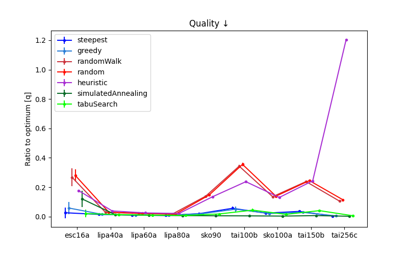

For the esc16 instance, random-based algorithms (random search and random walk) exhibit poor average performance combined with high variance. This indicates that the solution space is highly irregular, with good-quality solutions occupying only a small fraction of the search space. Consequently, the probability of locating high-quality solutions through unguided exploration is low. The high variance further suggests that results are strongly dependent on random initialization, confirming the presence of many low-quality local minima and a rugged fitness landscape. ON the other hand, for the lipa instances, all considered algorithms—including random search and random walk, consistently achieve high-quality solutions. This suggests that the solution space is relatively smooth and well-structured, with a large proportion of near-optimal solutions. Consequently, even unguided or weakly guided search methods are sufficient to locate good solutions, indicating low problem difficulty and low sensitivity to initialization. For the other instances, all algorithms exhibit very small standard deviations, indicating highly consistent performance across runs. This suggests that the solution space is stable and does not strongly depend on initialization or stochastic effects. 

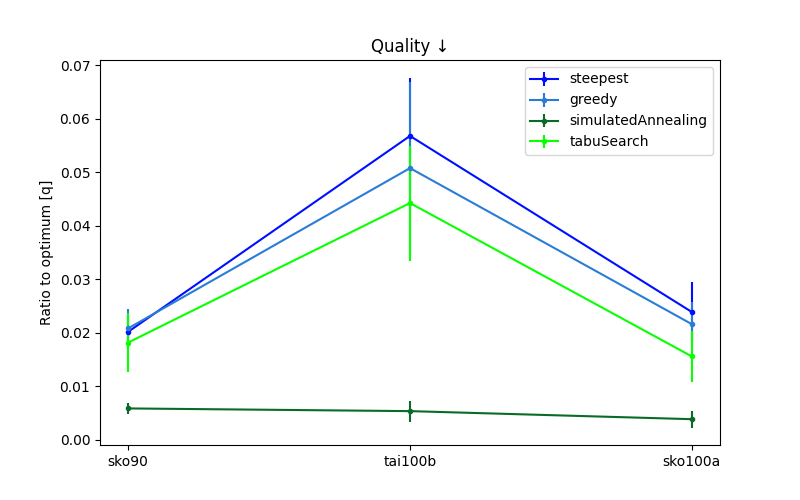

When we zoom in on these instances, we can see that Simulated Annealing performs significantly better. However, the gap between Tabu Search and local search methods is much smaller than the gap to Simulated Annealing. Tabu Search is stronger than plain local search, but it is still constrained by candidate-list filtering and fixed settings (elite list, tenure, max-no-improvement), which can reduce exploration diversity and cause earlier stagnation than SA. 

### Execution Time

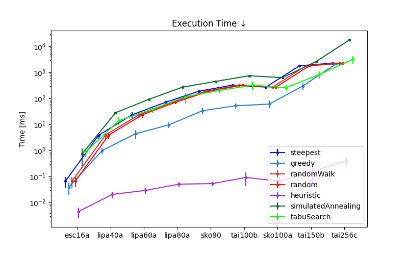

In terms of computational time, most evaluated algorithms exhibit similar execution times across all instances of the Quadratic Assignment Problem, which ensures a fair comparison of solution quality. The primary exception is the heuristic approach, which consistently shows significantly lower runtime on average. This is expected due to its deterministic and constructive nature, which avoids iterative neighborhood exploration and thus requires fewer evaluations. In contrast, local search and metaheuristic approaches involve repeated solution evaluations, leading to comparable and higher computational costs.

### Efficiency

Efficiency is defined as:

$$
\text{efficiency} = \frac{\text{quality(initial solution)} - \text{quality(best-found solution)}}{\text{time}}
$$

where *initial solution* is a random solution used to start the algorithm.  
This measure captures how much an algorithm is able to improve over the starting solution in a single time step. Given that the heuristic ignores the initial permutation and constructs one from scratch, it sometimes degrades the quality. It is included for completeness.

This definition of efficiency promotes algorithms that achieve the greatest improvement over the initial solution. While the measure itself suggests that final quality is directly proportional to time, we cannot assume that further execution will not change efficiency.

Please note the log scale on the y-axis.

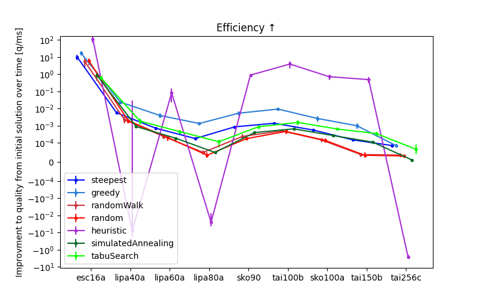

In terms of efficiency, greedy local search demonstrates the best overall performance, achieving a strong balance between solution quality and computational effort. Random-based algorithms exhibit the lowest efficiency, as they consume computational resources without effectively exploiting problem structure. The heuristic approach shows an irregular efficiency pattern, indicating strong dependence on instance characteristics. Its performance is highly variable across different cases, likely due to its deterministic construction mechanism, which lacks adaptive refinement during the search process.

### Number of Steps

Please note the log scale on the y-axis.

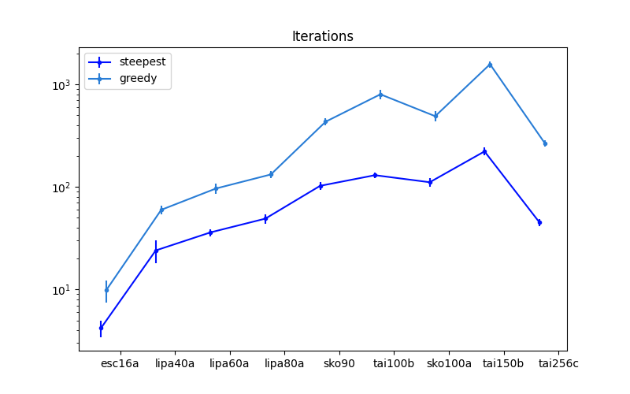

When comparing greedy and steepest local search on the Quadratic Assignment Problem, greedy local search performs a higher number of iterations. This is because each iteration is computationally inexpensive: the algorithm accepts the first improving move without evaluating the entire neighborhood. In contrast, steepest local search evaluates all possible moves at each step and selects the best improvement, resulting in fewer but more computationally intensive iterations. This highlights the trade-off between iteration cost and search intensity in local search strategies. For the largest dataset, both greedy and steepest local search show a decrease in the number of iterations. This behavior can be explained by the increased complexity of the search space. Each solution has many possible swaps, and at the same time, fewer improving moves are likely to be available from a given position, which reduces the number of successful iterations before reaching a local optimum.

### Number of Evaluations

Please note the log scale on the y-axis.

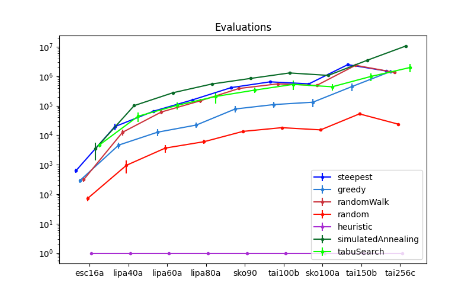

The number of evaluations increases with instance size, which is expected due to the growing neighborhood size in the Quadratic Assignment Problem. Algorithms based on local search and metaheuristics generally require significantly more evaluations, as they examine multiple candidate moves at each iteration. This cost was reduced for Tabu Search by introducing a candidate list, which restricts the number of evaluated moves while maintaining solution quality.
Interestingly, random search performs fewer evaluations across all instances. However, this is due to its lack of neighborhood exploration rather than higher efficiency. Consequently, despite its lower computational cost, random search generally produces inferior solutions compared to more advanced methods. The heuristic approach one evaluation across all tested instances. This is expected, as the heuristic is a purely constructive method that generates a solution in a single pass without performing iterative improvement or neighborhood exploration

## Discovering the structure of the search space and the optimized function

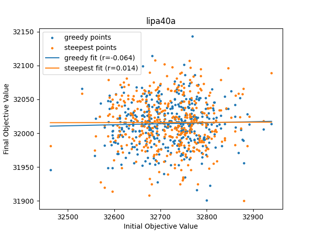
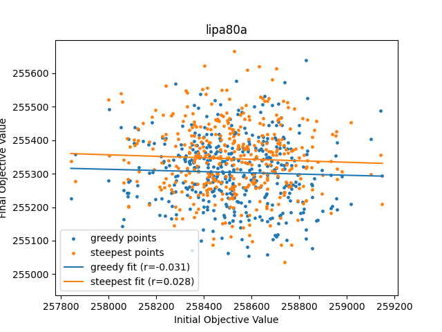
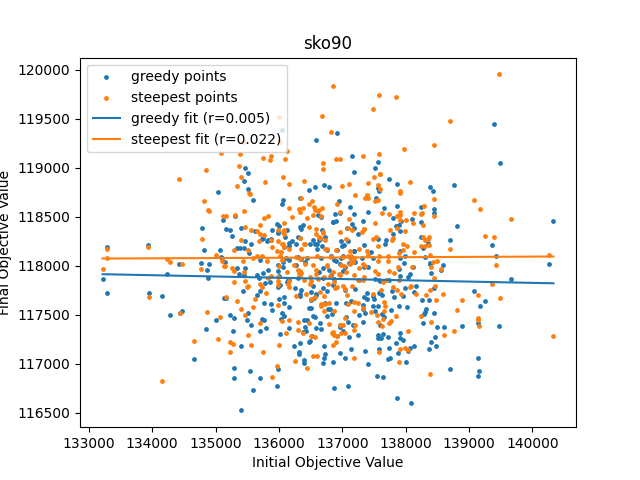
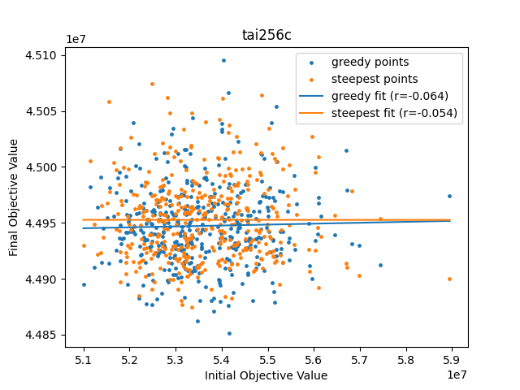

The scatter plots comparing the quality of initial solutions and the quality of final solutions obtained by the Greedy (G) and Steepest (S) algorithms do not indicate any significant correlation. The points are widely dispersed, and the computed correlation coefficient is close to zero.

## Discovering the preferred number of repetitions of LS

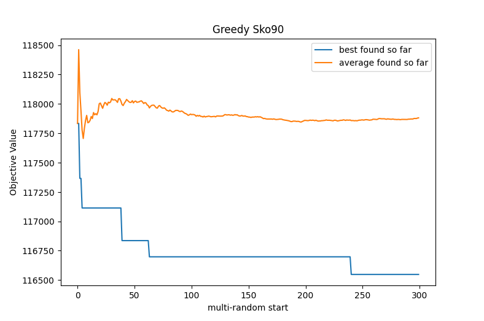
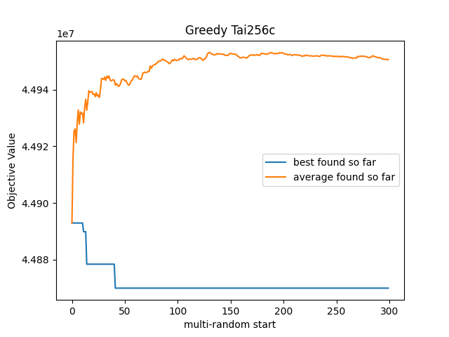
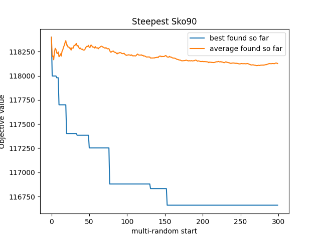
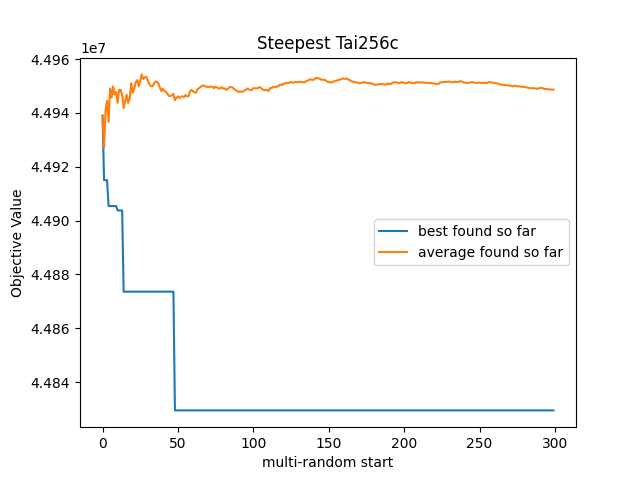

The results show that increasing the number of restarts initially leads to a rapid improvement in the best-found solution, as different regions of the search space are explored. However, after a certain number of repetitions, the improvement significantly slows down, and the curves begin to plateau. This indicates diminishing returns from additional restarts.

## Objective assessment of the similarity of locally optimal solutions
For similarity we count elements which are at the same place in both compared permuations and divide it by the length of the permuation.

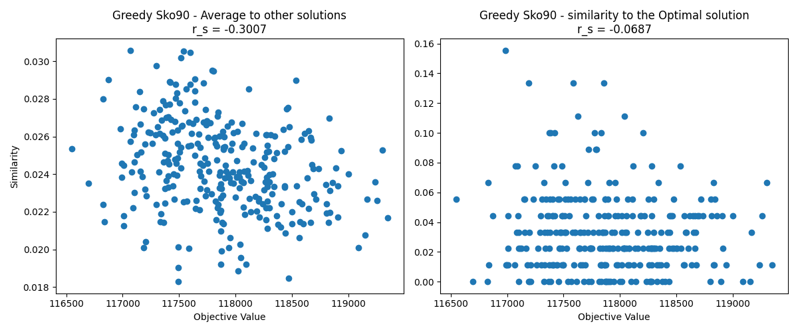
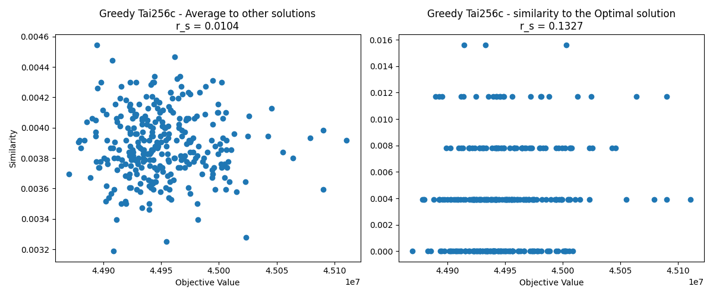
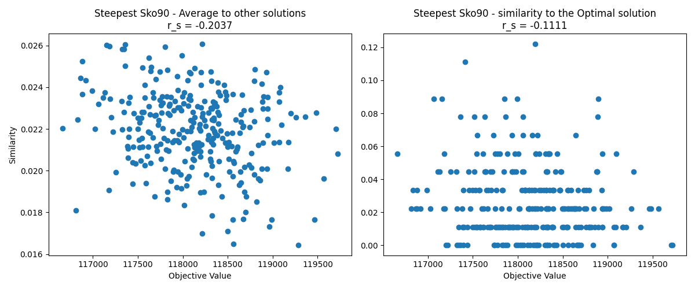
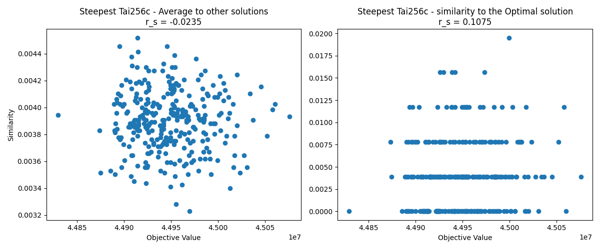

The analysis of similarity between locally optimal solutions, as well as between these solutions and the global optimum, reveals generally low similarity values. This indicates that high-quality solutions are structurally diverse, differing significantly in the assignment of facilities to locations. In other words, even solutions with comparable objective values may lie in distant regions of the search space and share relatively few common assignments. The low similarity to the optimal solution further suggests that local search methods often converge to distinct local optima that are not simple variations of the global optimum. This observation supports the view that the search space of the Quadratic Assignment Problem is highly multimodal, with many well-separated basins of attraction.

## Conclusions

The effectiveness of algorithms for the Quadratic Assignment Problem strongly depends on the structure of the solution space, which varies significantly between instances.
There is no single algorithm that consistently outperforms others across all instances; instead, performance depends on the balance between exploration and exploitation as well as instance characteristics. More advanced methods (local search and metaheuristics) significantly outperform random-based approaches in terms of solution quality, especially for difficult and irregular instances.

Random search and random walk are inefficient and unreliable. Heuristic method was extremely fast but inconsistent, as they do not refine solutions and depend heavily on instance structure. Local search algorithms provide strong performance, with greedy local search offering the best overall efficiency. Steepest local search achieves fewer but more computationally expensive iterations. Metaheuristics maintain a good balance between exploration and exploitation, making them suitable for harder instances.

Some instances (e.g., lipa-type) are relatively easy, with smooth landscapes where even simple methods perform well. Other instances (e.g., esc16) are highly irregular, with many local minima, making them difficult for unguided algorithms. Many instances show low variance in results, indicating stable search spaces with predictable algorithm behavior.

Efficiency is maximized when an algorithm achieves significant improvement with relatively low computational cost. The greedy local search outperforms otheres with this criterion. The number of evaluations grows with instance size, making optimization techniques like candidate lists (in Tabu Search) important for scalability. Lower evaluation counts (e.g., in random search) do not imply better performance, but rather insufficient exploration.

There is little to no correlation between the quality of initial and final solutions, indicating that local search effectively escapes poor starting points. Larger instances reduce the number of successful improving iterations due to increased search space complexity and fewer improving move

## Difficulties

It is hard to define good quality measure for QAP, where the upper bound is not defined. Instinctively we would want the quality measure to be maximized, but simple (and in our opinion quite good) quality measures lead us to define lower valued quality to be better (which is counter intuitive). 

## Suggestions for future improvements and their expected effects

Suggested improvements:
 - Applying hybrid metaheuristics, which combine local search with adaptive metaheuristics such as Genetic Algorithms, could improve exploration, helping avoid local optima traps and potentially discovering better solutions.
 - Running multiple local searches or neighborhood evaluations in parallel could drastically reduce runtime, especially on large instances like tai256c.

Overall, the implemented and proposed improvements target both algorithmic efficiency and solution effectiveness, providing a strong foundation for further enhancements in solving large and complex QAP instances.