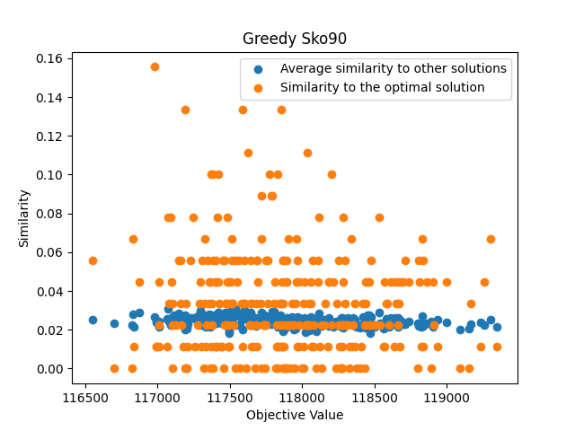
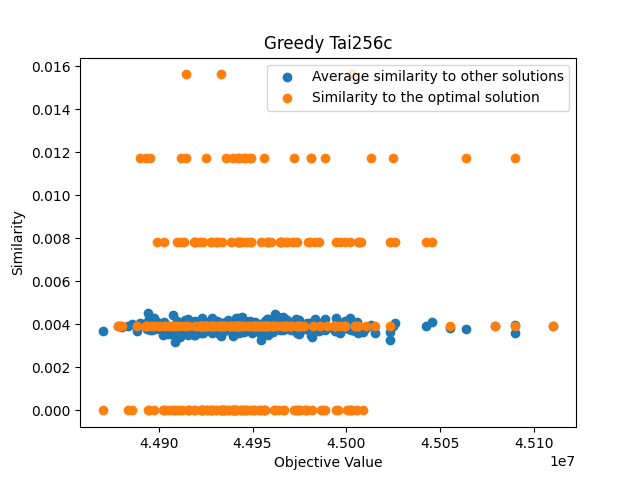
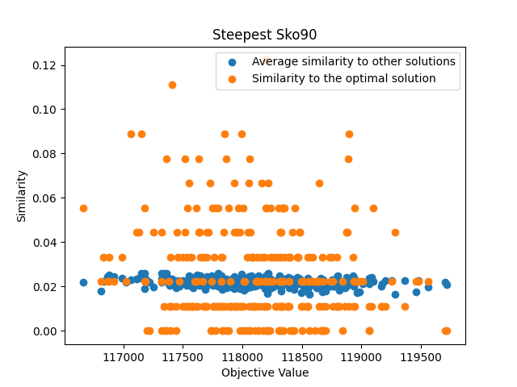
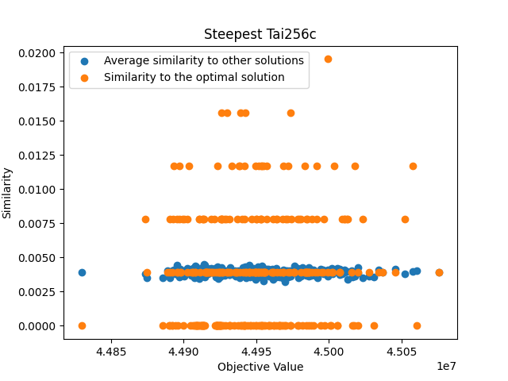

We consider the Quadratic Assignment Problem, a classical combinatorial optimization problem in which a set of facilities must be assigned to a set of locations in a way that minimizes the total cost. The cost is defined based on flows between facilities and distances between locations, leading to a quadratic objective function.

## Chosen instances:
 - esc16
 - lipa40a
 - lip60a
 - lipa80a
 - sko90
 - sko100a
 - tai100b
 - 150b
 - tai256c

The instances were chosen to ensure diversity in size and structure, in order to increase the difficulty for the algorithm. Such a selection provides a comprehensive evaluation environment for comparing the performance, stability, and efficiency of the considered algorithms across different types of QAP instances.

## Our Implementation

The implementation was written in Go and focuses on efficiency and fair comparison of different algorithms for the Quadratic Assignment Problem. Solutions are represented as permutations, and the objective function is evaluated using a standard quadratic cost formulation based on flow and distance matrices stored in row-major format.

To improve performance, a delta evaluation function is implemented, allowing the cost difference between neighboring solutions (generated by swapping two positions) to be computed in $O(n)$ time instead of recomputing the full objective in $O(n^2)$. This is crucial for local search methods (Greedy and Steepest), which evaluate many neighboring solutions.

The heuristic constructs an initial permutation by ranking locations and objects based on their connectivity scores, summing the corresponding rows and columns of matrices $A$ and $B$. It then matches the closest locations with the highest flows.

### Neighbour Operator

The implemented algorithms use a 2-swap neighborhood operator, which is standard for the Quadratic Assignment Problem. A neighboring solution is generated by selecting two distinct positions $i$ and $j$ in the permutation and swapping the assigned facilities. The size of the neighborhood for a permutation of size $n$ is:

$$
\frac{n(n-1)}{2}
$$

Instead of recomputing the full objective function for each neighbor (which would take $O(n^2)$), the implementation uses a delta evaluation function that computes the cost difference between two solutions differing by a swap in $O(n)$ time.

## Comparison of the performance

### Quality

The quality of a solution is defined as: 

$$
\text{quality} = f(\pi) - f^*
$$

where:  
 - $f(\pi)$ is the objective value of the obtained solution,  
 - $f^*$ is the optimal objective value.

This measure represents the difference between the best-found solution and the optimum.

### Execution Time

### Efficiency

Efficiency is defined as:

$$
\text{efficiency} = \frac{\text{quality(initial solution)} - \text{quality(best-found solution)}}{\text{time}}
$$

where *initial solution* is a random solution used to start the algorithm.  
This measure captures how much an algorithm is able to improve over the starting solution in a single time step. Given that the heuristic ignores the initial permutation and constructs one from scratch, it sometimes degrades the quality. It is included for completeness.

This definition of efficiency promotes algorithms that achieve the greatest improvement over the initial solution. While the measure itself suggests that final quality is directly proportional to time, we cannot assume that further execution will not change efficiency.

Please note the log scale on the y-axis.

### Number of Steps

Please note the log scale on the y-axis.

### Number of Evaluations

Please note the log scale on the y-axis.

## Discovering the structure of the search space and the optimized function

The scatter plots comparing the quality of initial solutions and the quality of final solutions obtained by the Greedy (G) and Steepest (S) algorithms do not indicate any significant correlation. The points are widely dispersed, and the computed correlation coefficient is close to zero.

## Discovering the preferred number of repetitions of LS

The results show that increasing the number of restarts initially leads to a rapid improvement in the best-found solution, as different regions of the search space are explored. However, after a certain number of repetitions, the improvement significantly slows down, and the curves begin to plateau. This indicates diminishing returns from additional restarts.

## Objective assessment of the similarity of locally optimal solutions
For similarity we count elements which are at the same place in both compared permuations and divide it by the length of the permuation.

## Conclusions

Execution time of the algorithms grows with the instance size.  
Steepest and greedy searches, in general, achieve better results than random methods and the heuristic.  
They do so in a more efficient manner, achieving bigger improvement per unit of time.  
Greedy local search converges to a local optimum in a shorter running time, performing more iterations than steepest local search, while at the same time performing fewer evaluations. This makes the greedy algorithm more time-efficient, at the cost of slightly worse final results.

Random searches performed consistently worse than greedy and steepest.  
They were more susceptible to the instance structure; for some instances, random searches were nearing the performance of greedy and steepest, while on others they were behind by a wide margin. Despite the big difference in the number of evaluations, there was little difference in the quality of the final result between random walk and random search. This could be explained by the difference in exploration of the solution space. Random search encounters a diverse range of solutions, while random walk is more centered around the initial solution.

Our chosen heuristic was not very effective, but it was extremely fast to execute because it is constructed in a single step. For some instances, our heuristic produced solutions with very weak fitness scores. Its efficiency was mostly dependent on whether it was able to improve upon the initial solution.

For our chosen solution set, there was little correlation between the quality of the initial solution and the quality of the final result.

For greedy and steepest local searches, the quality of the best-found objective value improves with the number of restarts. The improvements diminish above 150 restarts.

Looking at similarity of locally optimal solutions produced by greedy and steepest algorithm for large sized instances it is difficult to find a clear trend showing a correlation between similarity and objective value. This is probably due to a limitation of the similarity measure used.

## Difficulties

It is hard to define good quality measure for QAP, where the upper bound is not defined. Instinctively we would want the quality measure to be maximized, but simple (and in our opinion quite good) quality measures lead us to define lower valued quality to be better (which is counter intuitive). 

## Suggestions for future improvements and their expected effects

Suggested improvements:
 - Applying hybrid metaheuristics, which combine local search with adaptive metaheuristics such as Tabu Search, Simulated Annealing, or Genetic Algorithms, could improve exploration, helping avoid local optima traps and potentially discovering better solutions.
 - Running multiple local searches or neighborhood evaluations in parallel could drastically reduce runtime, especially on large instances like tai256c.

Overall, the implemented and proposed improvements target both algorithmic efficiency and solution effectiveness, providing a strong foundation for further enhancements in solving large and complex QAP instances.